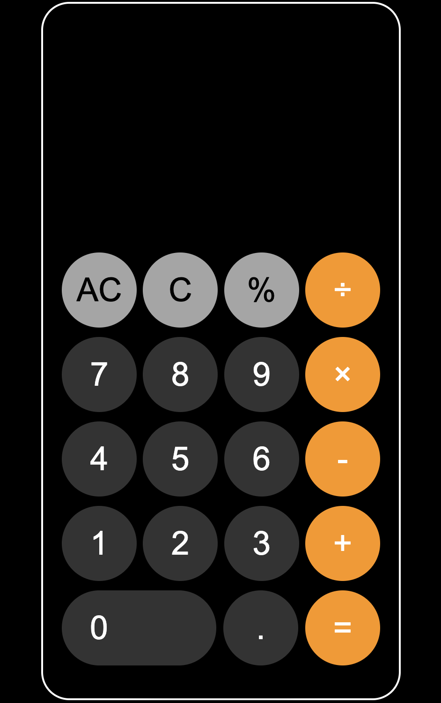

# iOS 계산기

이 프로젝트는 HTML, CSS, Javascript를 연습하기 위해 만든 프로젝트이며, 이 프로젝트를 진행하면서 바닐라 자바스크립트에 대한 이해가 한층 더 높아졌으며, 평소에 생각해보지 않았던 자바스크립트의 기능들에 대해 더 알 수 있는 기회가 되었다.

비록 간단한 프로젝트이지만 최대한 비슷하게 만들기 위해 노력하였습니다. 이 프로젝트는 간단한 복습차원의 프로젝트라 반응형 디자인 등 세심함이 조금 떨어질 수 있습니다.
